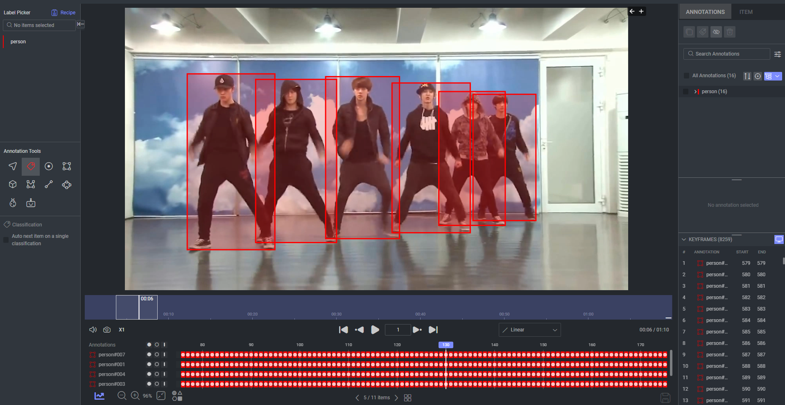
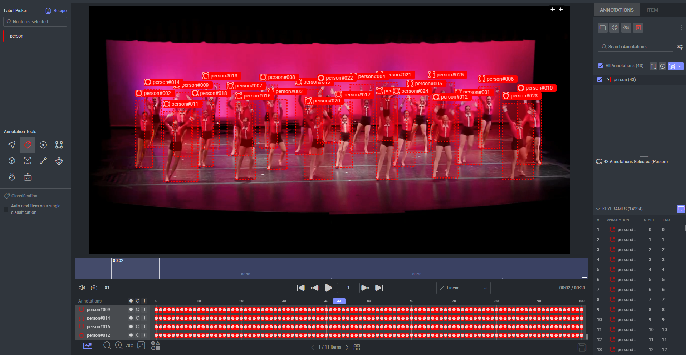

# Dataset adapter for DanceTrack

This dataset adapter is designed to facilitate the transformation of the [DanceTrack](https://sites.google.com/view/dancetrackmot)
dataset from zip into a format compatible with Dataloop platform.\
The adapter simplifies the process of importing and preparing the dataset for various deep learning tasks.

## Data Examples

After installing the dataset app, a new dataset will be created with videos annotated with bounding box annotations.\
See examples:

example 1:

example 2:

## Installation

1. Navigate to **Startline**.
2. Select **Datasets**.
3. Click on **Install**.
4. After a while, a new dataset will be created and visible under your **Data** section.
